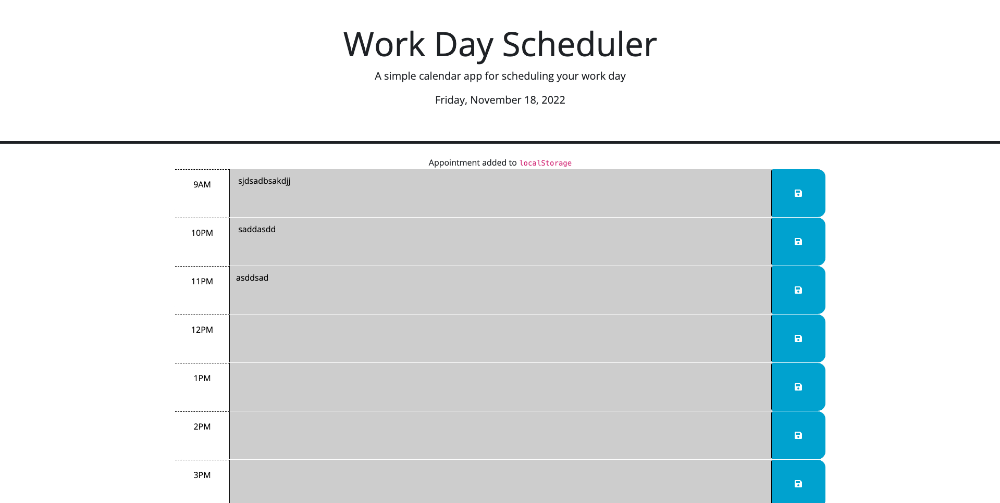

# <fluffy-giggle>

## Description

With this project I took a starter code and turned it into a smooth working hourly day calendar. This was possible by putting the knowledge and skills that I have gained working with JavaScript, JQuery, BootStrap, and other resources available to me. During this project I learned that there are so many resources out there that make designing more complex things possible. 

## Usage

To use this application is quite simple. Just select the time that you have a event and fill it in. Press the save button and this inputs it in the console log, as well as stores it in the time slot even if you refresh the page. Below are two example screenshots.

    
  
  
    
## Website Link

https://dossj88.github.io/fluffy-giggle/
